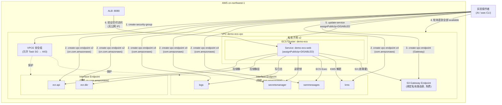
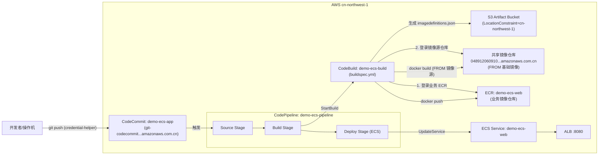
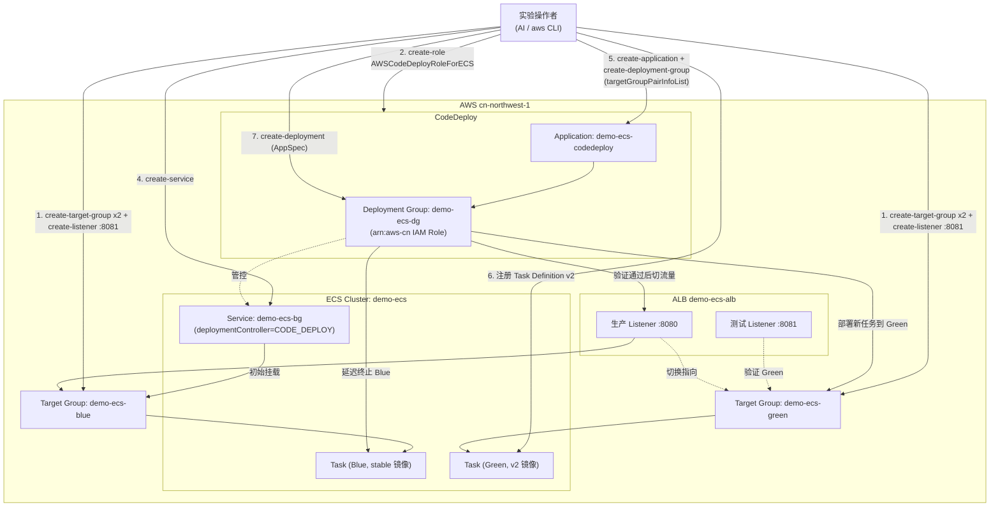

# 架构文档

本仓库包含 14 个 Demo，这里不做全量架构图汇总，只对其中组件交互较复杂、值得可视化的 Demo 提供架构图；其余 Demo 请直接看对应的 `docs/demoXX-*.md`。

选取标准：跨多个 AWS 服务编排、存在中国区特有的网络/身份限制、或有明确的多步骤调用链路。据此选出 3 个 Demo：**Demo08（私有子网与 VPC Endpoint）**、**Demo10（CodePipeline CI/CD）**、**Demo13（CodeDeploy 蓝绿发布）**。

---

## Demo08 — 私有子网与 VPC Endpoint

Demo08 把 `demo-ecs-web` Service 从公有子网迁移到私有子网，为此需要建齐 6 个 Interface VPC Endpoint（`ecr.api`、`ecr.dkr`、`logs`、`secretsmanager`、`ssmmessages`、`kms`）加 1 个 S3 Gateway Endpoint。中国区的坑在于 **ECR 的两个 Endpoint 服务名前缀是 `cn.com.amazonaws`，其余四个是 `com.amazonaws`**，混用会报 `InvalidServiceName`；Endpoint 安全组要放行 Task 安全组到 443 端口，所有 Endpoint 变为 `available` 后才能把 Service 的 `assignPublicIp` 改为 `DISABLED` 并强制重新部署。

---

## Demo10 — CodePipeline 自动部署 ECS

Demo10 搭建 CodeCommit → CodeBuild → CodePipeline 三段式流水线。中国区差异集中在三处：CodeCommit clone URL 用 `.com.cn` 域名；`buildspec.yml` 的基础镜像来自共享镜像仓库而非 `public.ecr.aws`，CodeBuild 需登录两个 ECR registry；Service Role ARN 统一用 `arn:aws-cn:` 前缀。Demo 最后修改 Dockerfile 再次 `git push`，验证 Pipeline 的自动触发能力。

---

## Demo13 — CodeDeploy 蓝绿发布

Demo13 用独立的 `demo-ecs-bg` Service（`deploymentController=CODE_DEPLOY`）演示蓝绿发布：生产 Listener `:8080` 保持不变，额外开一个 `:8081` 测试 Listener（规避中国区备案限制），分别指向 Blue/Green 两个 Target Group。提交 AppSpec 后 CodeDeploy 把新任务跑到 Green、先在测试端口验证，再把生产 Listener 切到 Green。

